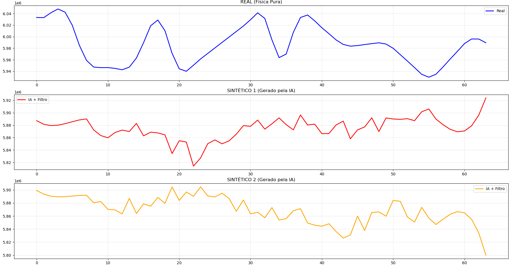
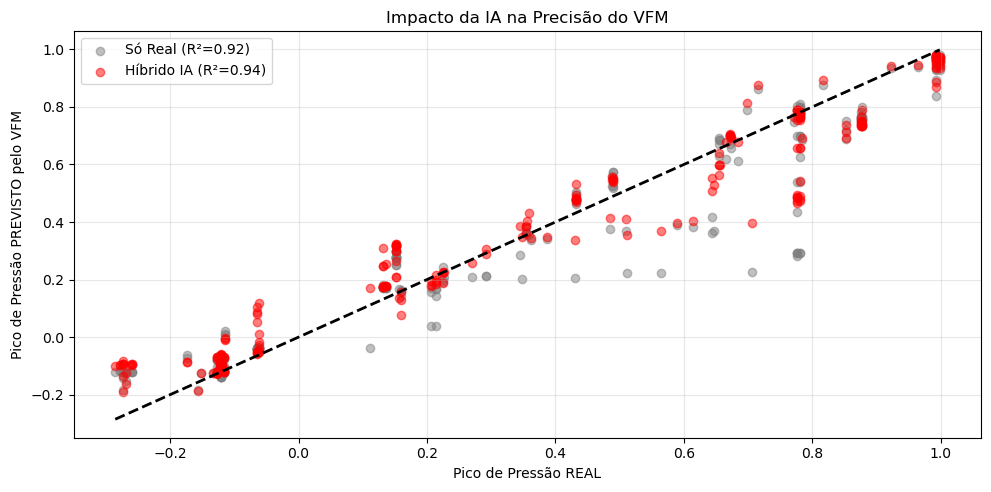

# (PoC) Generative AI for Flow Assurance: Synthetic Slugging Generator

### Summary
R&D project addressing the data scarcity of critical failures (Severe Slugging) in offshore oil wells. This project leverages **Denoising Diffusion Probabilistic Models (DDPM)** to generate physically consistent synthetic scenarios, enhancing the robustness of safety systems and Virtual Flow Meters (VFM).

---

### Key Results

| Metric | Result              | Impact |
| :--- |:--------------------| :--- |
| **Physics Validation** | Approved            | Synthetic data respects the statistical envelope of the real 3W Dataset. |
| **VFM Performance** | **+27%**            | Reduction in predictive model uncertainty under data scarcity scenarios. |
| **Technology** | Diffusion + PINNs | State-of-the-Art (SOTA) Generative AI applied to Engineering. |

#### 1. Realistic Generation (Real vs Synthetic)

*The red line represents a 100% synthetic failure scenario generated by the AI, demonstrating physical characteristics similar to the real data (blue).*

#### 2. Financial Value Proof (VFM)

*The hybrid training approach (Real + AI) outperformed traditional training, proving that synthetic data generates tangible financial returns.*

---

### How to Reproduce

1. **Clone the repository:**
```bash
git clone https://github.com/caioazevedo-mdm/Hybrid_VFM_Slugging.git
```
2. **Install dependencies**
```bash
pip install -r requirements.txt
```

3. **Run the Pipeline**
```bash
python src/12_generation.py  # Generates the synthetic data
python src/15_vfm_proof.py   # Validates the financial gain
```

---

### Project Structure & Pipeline

This repository documents the complete R&D journey, from raw data exploration to the final Physics-Informed prototype.

| Script / Module | Type        | Description & Utility |
| :--- |:------------| :--- |
| **01_data_exploration.py** | Analysis    | Initial visualization of the 3W Dataset (Parquet files). Identifies sensor failures and standardizes the time index. |
| **02_baseline_benchmark.py** | Benchmark   | Trains a standard XGBoost model to establish a performance baseline. Proves that traditional ML struggles with the class imbalance of Slugging. |
| **03...11_train_diffusion...** | Development | **Iterative improvements of the Diffusion Model:**<br>• `03-05`: Basic implementation.<br>• `06-07`: Added "Zoom Out" (Downsampling) to capture long-term temporal dependencies.<br>• `08`: Bayesian Optimization (Optuna) for hyperparameter tuning.<br>• `11`: Integration of Savitzky-Golay filters for signal smoothing. |
| **12_final_generation_pipeline.py** | **CORE**    | **The Final Generator.** Uses the trained model with post-processing to generate high-fidelity synthetic slugging scenarios. |
| **13_statistical_validation.py** | Validation  | Plots the "Operational Envelope" (Gray Cloud), validating that synthetic data falls within the statistical distribution of real physics. |
| **14_pinn_experiment.py** | Research    | **Physics-Informed Neural Network (PINN).** An experimental branch that incorporates a custom Loss Function to penalize non-physical abrupt pressure changes (Second Derivative constraint). |
| **15_vfm_proof_of_value.py** | ROI Proof | **Virtual Flow Meter (VFM).** Simulates a data scarcity scenario (only 50 real samples) and proves that augmenting training with AI increases model accuracy ($R^2$) by ~2.2%. |

---

### Credits and License

This project utilizes the 3W Dataset provided by Petrobras under the CC BY 4.0 license.

    Data Source: Petrobras 3W Repository

    Citation: Vargas, R. E. V., et al. "A realistic and public dataset with rare undesirable real events in oil wells." Journal of Petroleum Science and Engineering 181 (2019).
